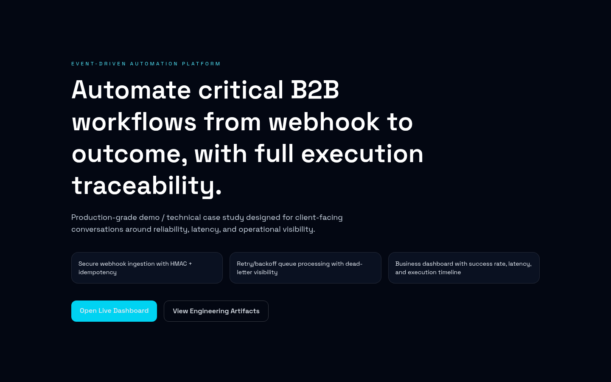
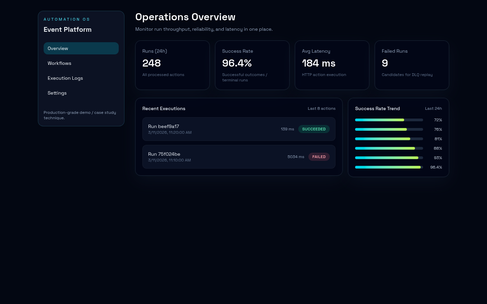
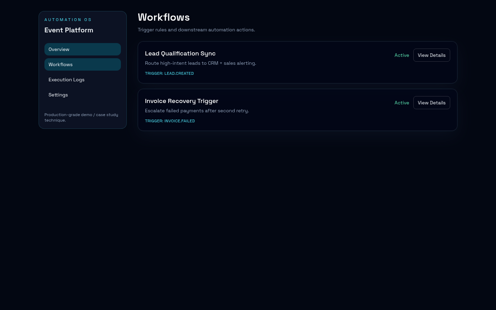
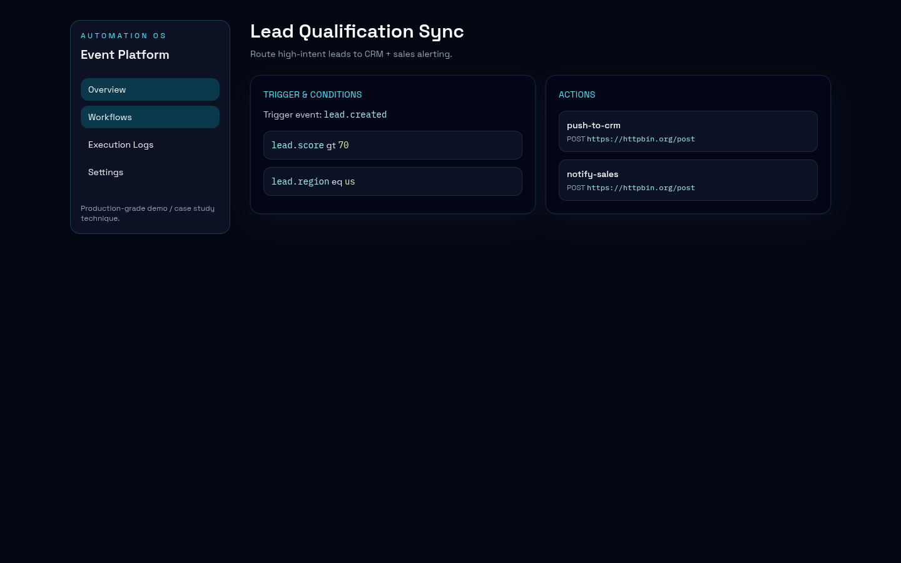
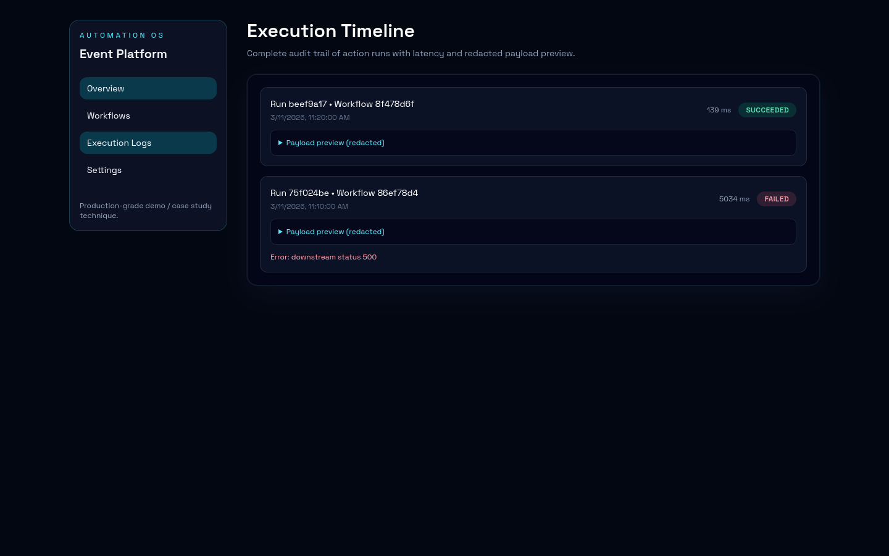
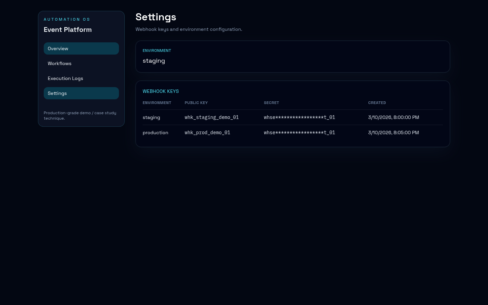
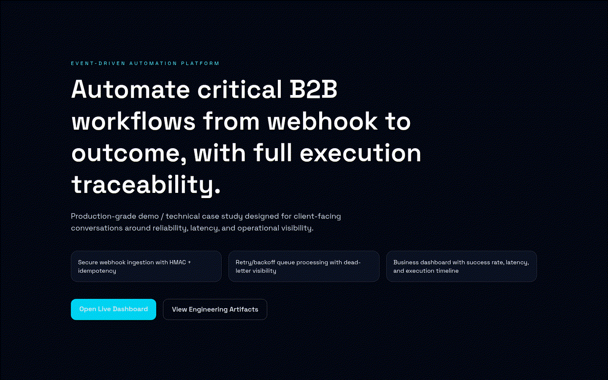
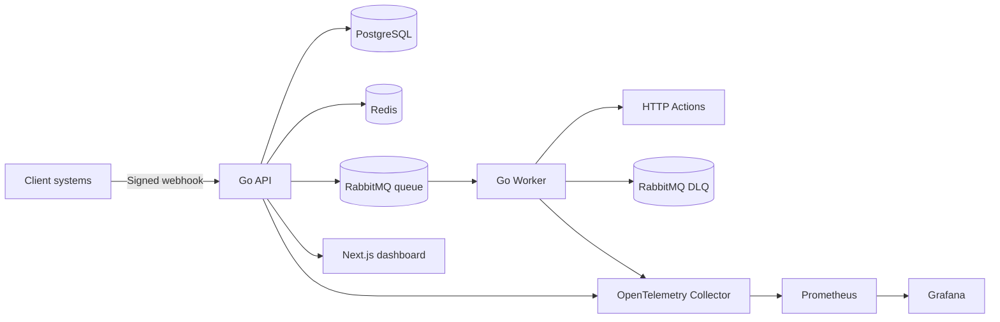

# event-driven-automation-platform

Production-grade demo and technical case study of a B2B event-driven automation platform, built for client-facing presentations.

> Public positioning: **production-oriented technical demo**, with no unverifiable client or revenue claims.

## Phase 0: stack 2026-ready (versions vérifiées le 11 mars 2026)

| Layer | Version retenue | Source officielle |
|---|---:|---|
| Next.js | 16.1.6 | https://nextjs.org/support-policy |
| React | 19.2.4 | https://react.dev/versions |
| TypeScript | 5.9.3 | https://www.typescriptlang.org/download |
| Tailwind CSS | 4.2.1 | https://tailwindcss.com/docs/installation |
| Motion (Framer Motion) | 12.35.2 | https://motion.dev/docs |
| Go | 1.26.1 | https://go.dev/dl/ |
| PostgreSQL | 18.3 | https://www.postgresql.org/versions.rss |
| Redis | 8.6.1 | https://github.com/redis/redis/releases |
| RabbitMQ | 4.2.4 | https://www.rabbitmq.com/release-information |
| OpenTelemetry Go SDK | 1.42.0 | https://github.com/open-telemetry/opentelemetry-go/releases |
| Prometheus | 3.10.0 | https://prometheus.io/download/ |
| Grafana | 12.4.1 | https://github.com/grafana/grafana/releases |

Why this stack fits the 2026 freelance market:
1. Stack standard demandée sur missions SaaS B2B (Next + Go + Postgres + queue).
2. Composants matures, cloud-agnostiques, déployables en Docker sans friction.
3. RabbitMQ + worker Go couvrent les exigences fiabilité (retry/backoff/DLQ).
4. OTel + Prometheus + Grafana rendent le discours SLA concret pour un client non-tech.
5. Next.js 16 UX makes the business narrative understandable in under 30 seconds.
6. Forte crédibilité “engineering produit” tout en restant simple à opérer.

## Product Scope (P0)

- Webhook ingestion sécurisé (`HMAC SHA-256` + `Idempotency-Key`).
- Rule engine simple (`triggers + conditions + actions`).
- Queue processing RabbitMQ avec retries exponentiels + DLQ.
- Exécution d’actions HTTP sortantes.
- Journal d’exécution (succès/échec, latence, payload preview redacted).
- Dashboard métier: overview, workflows, logs timeline, settings.

## Screens









GIF demo: [`docs/gifs/demo-walkthrough.gif`](docs/gifs/demo-walkthrough.gif)

## Architecture



Detailed architecture: [`docs/ARCHITECTURE.md`](docs/ARCHITECTURE.md)

## Repo structure

```text
apps/
  api/        # Go API + worker + migrations + tests
  web/        # Next.js client-facing dashboard
infra/        # Prometheus, Grafana, OTel configs
openapi/      # OpenAPI contract
scripts/      # demo, bootstrapping GitHub, dev helpers
docs/         # architecture, demo walkthrough, screenshots
```

## Quickstart (one-liner)

```bash
./scripts/dev-up.sh
```

Then open:
- Web: http://localhost:3000
- API: http://localhost:8080
- RabbitMQ: http://localhost:15672
- Prometheus: http://localhost:9090
- Grafana: http://localhost:3001

Stop:

```bash
./scripts/dev-down.sh
```

## Test, lint, build

Backend tests:

```bash
cd apps/api
go test ./...
```

Frontend lint + build:

```bash
cd apps/web
npm run lint
npm run build
```

## OpenAPI

- Contract: [`openapi/openapi.yaml`](openapi/openapi.yaml)

## 5-minute client demo script

- [`docs/DEMO.md`](docs/DEMO.md)

## GitHub workflow (team-grade)

- PR template: [`.github/pull_request_template.md`](.github/pull_request_template.md)
- Issue templates: [`.github/ISSUE_TEMPLATE/`](.github/ISSUE_TEMPLATE)
- CODEOWNERS: [`.github/CODEOWNERS`](.github/CODEOWNERS)
- CI: [`.github/workflows/ci.yml`](.github/workflows/ci.yml)
- Release notes workflow: [`.github/workflows/release.yml`](.github/workflows/release.yml)
- GitHub setup script (labels + branch protection): [`scripts/setup-github.sh`](scripts/setup-github.sh)
- Protocol details: [`docs/GITHUB_PROTOCOL.md`](docs/GITHUB_PROTOCOL.md)
- PR breakdown: [`docs/PR_PLAN.md`](docs/PR_PLAN.md)
- Release roadmap: [`docs/RELEASES.md`](docs/RELEASES.md)

## Example webhook trigger

```bash
./scripts/demo-webhook.sh
```

This sends a signed event to:
- `POST /api/v1/webhooks/whk_staging_demo_01`

## License

MIT - see [`LICENSE`](LICENSE)
