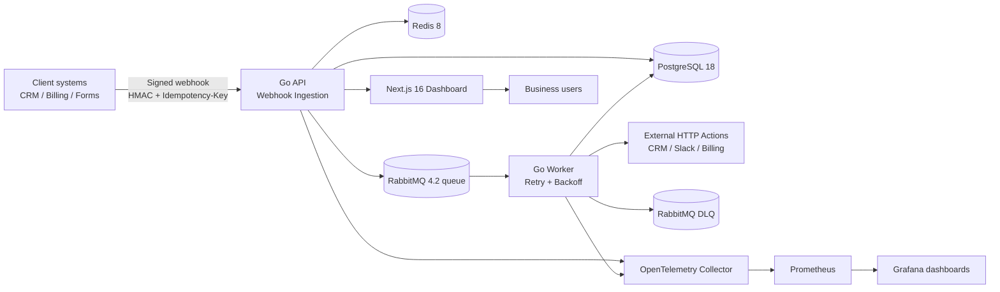

# Architecture

## Notes

- **Security**: HMAC SHA-256 signature verification + Redis idempotency reservation before persistence.
- **Reliability**: retries are exponential (1s, 2s, 4s by default) and failed jobs are routed to DLQ.
- **Auditability**: execution logs persist status, latency, redacted payload preview, and response/error snippets.
- **UX**: dashboard targets non-technical stakeholders with KPI-first information architecture.
